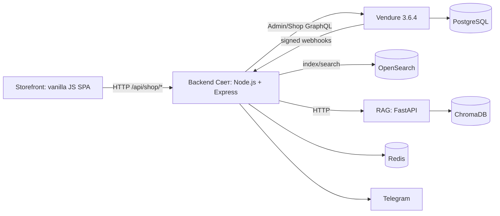

# Текущая архитектура «Мир Сальников»

Дата фиксации: 2026-06-12. Документ описывает текущее, проверенное поведение системы до изменений базы данных и публичных API.

## Компоненты

| Компонент | Расположение | Ответственность |
| --- | --- | --- |
| Storefront | корень, `src/` | UI, маршрутизация, ввод пользователя, локальное представление корзины |
| Backend «Свет» | `BOT TG/backend/` | API-фасад, интеграции, Telegram, аналитика, синхронизация и оркестрация commerce-flow |
| Vendure | `vendure-svet/` | товары, варианты, цены, валюта, клиенты, заказы и состояния commerce-сущностей |
| PostgreSQL | Docker Compose | постоянное хранилище Vendure |
| OpenSearch | Docker Compose | поисковая проекция каталога |
| Redis | Docker Compose | инфраструктурный cache/coordination слой |
| RAG | `rag/` | документы, embeddings, retrieval и ChromaDB-индекс |
| Infrastructure | `infra/` | локальный Docker Compose stack и конфигурация окружения |

## Зафиксированные границы

1. Vendure является источником истины для commerce-данных. Финальная цена, валюта, заказ и его состояние не должны определяться storefront.
2. Backend «Свет» владеет интеграциями и предоставляет storefront стабильный HTTP-фасад.
3. Python-сервис владеет RAG-конвейером, индексом документов и retrieval-ответами.
4. Storefront отвечает только за пользовательский интерфейс и не обращается напрямую к PostgreSQL, OpenSearch, Redis или RAG.
5. OpenSearch хранит восстанавливаемую поисковую проекцию, но не является источником истины для заказа или цены checkout.

## Текущий commerce-flow

1. Storefront получает каталог и поиск через backend.
2. Backend читает поисковую проекцию из OpenSearch.
3. Перед оформлением backend запрашивает quote у Vendure.
4. Backend создаёт локальную запись заказа и связанный Vendure Draft Order.
5. В локальной записи сохраняются `vendureOrderId`, `vendureOrderCode`, `vendureOrderState`, валюта и сумма Vendure.
6. Vendure отправляет подписанные webhook-события в backend при создании и смене состояния заказа.
7. Менеджер видит связанный заказ в Vendure Admin UI.

## Персистентность сейчас

| Данные | Текущее хранилище | Статус |
| --- | --- | --- |
| Vendure products, variants, customers, orders | PostgreSQL | постоянное |
| Поисковый каталог | OpenSearch | постоянная восстанавливаемая проекция |
| RAG embeddings/documents | ChromaDB | сервис доступен, коллекция отсутствует |
| Локальные orders/carts/selection requests/analytics | JS `Map` и массивы backend | непостоянное, теряется при рестарте |
| Leads и часть integration logs | память процесса backend | непостоянное |
| Prisma schema | `BOT TG/backend/prisma/` | подготовлено, но Prisma Client не используется runtime-кодом |

## Проверка окружения

| Проверка | Результат 2026-06-12 |
| --- | --- |
| Frontend `http://127.0.0.1:4173/` | HTTP 200 |
| Backend `/health` | OK |
| Backend `/health/deep` | OK; Vendure, OpenSearch и RAG доступны |
| Vendure `/health` | OK |
| PostgreSQL `pg_isready` | accepting connections |
| Redis `PING` | PONG |
| OpenSearch cluster (`http://127.0.0.1:9201`) | green |
| RAG `http://127.0.0.1:8010/health` | HTTP OK, `indexReady=false`, `collection_missing` |

Прямой запуск `quick-start.sh` на Windows-хосте невозможен без Bash/WSL-дистрибутива. Эквивалентный Docker Compose stack был поднят и проверен; полный `--build` превысил таймаут управляющей команды, но все контейнеры остались в состоянии running/healthy.

## Известные архитектурные риски

- Локальные заказы и связующая информация backend пока находятся в памяти. После рестарта связь может быть потеряна, хотя Vendure order останется в PostgreSQL.
- Prisma-схема не означает фактическую персистентность: runtime backend пока не использует `PrismaClient`.
- Endpoint помощника в Node.js сейчас использует Gemini/OpenAI или локальный fallback и не всегда проходит через Python RAG.
- RAG API доступен, но Chroma-коллекция `mir_salnikov_project_knowledge` не создана.
- В Prisma указан vector размерности 1536, а текущая MiniLM-модель формирует 384 измерения.
- Сумма `350 KZT` в backend/Vendure API отображается как `3.50` в Vendure Admin UI: требуется отдельное решение по minor units.
- Draft Order виден в списке заказов, но не обязан попадать в стандартные dashboard-виджеты Vendure.

На этом этапе риски только зафиксированы. Бизнес-логика и модель данных не изменялись.
